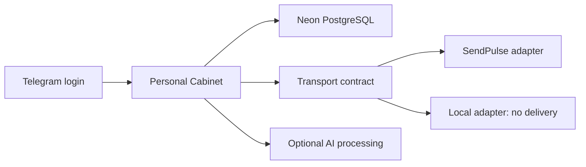

# Personal Cabinet — selfdev between consultations

[English](README.md) · [Русский](README.ru.md)

An open-source personal cabinet for consultation summaries, journals, working patterns and period reviews. Deploy it with **your own** database, Telegram bot, AI account and optional SendPulse/SMTP services.

This repository contains the application, database migrations, setup tools and operator documentation. It does not contain the author's deployment, accounts, subscriber database or private bot export. The application interface is in Russian; the guides are bilingual.

## What is included

- Seven working areas: basic settings, all variables, consultation summaries, journals, analysis, working patterns and retrospectives.
- Telegram Login Widget / WebApp authentication, signed sessions and server-side contact ownership checks.
- Consultation summary preview and selective application; asynchronous AI processing; optional email.
- A transport contract with **SendPulse** and **local** adapters. Domain handlers use that contract instead of importing the vendor API.
- Database migrations, a non-overwriting configuration initializer, an environment checker and a static asset allowlist build.
- [Operator installation guide](docs/operator-install.md), [SendPulse reconstruction kit](docs/sendpulse-setup.md) and [complete user guide](docs/user-guide.md).



## Install with your own accounts

Node.js 22.9+, a Neon-compatible database and a Telegram bot are required. Netlify runs the existing Functions stack. SendPulse is optional in `local` mode; that mode still needs the application database and Telegram authentication and is **not an offline app**.

```sh
git clone https://github.com/KiteTools/selfdev-cabinet.git
cd selfdev-cabinet
npm ci
npm run setup
```

`setup` creates an ignored `.env` with new random server secrets and refuses to overwrite an existing file. Fill it with your own settings. Continue through [installation](docs/operator-install.md): validate configuration, apply migrations to a fresh database, deploy only `dist/` plus the Functions directory, configure the bot domain, and check your first login. Never deploy the whole repository as static files.

```sh
npm run check:env
npm run migrate
npm run build
npm test
```

`migrate` without arguments prints a plan and changes nothing. Applying it requires an explicit `--apply` and `psql`. The guide covers backup, restoration and upgrades.

## Replace the transport

Set `CABINET_TRANSPORT=sendpulse` for the supplied SendPulse integration or `local` for database-only saves with no bot delivery. To add another provider, implement the contract in `netlify/functions/lib/transport.js`, including verified account binding, then add it to the factory and tests. [Adapter contract](docs/transports.md).

This release separates the adapter boundary; it does not ship a direct Telegram bot, a durable outbox, automatic replay of inbound events, or migration of existing contact bindings between providers. The database retains compatibility field names such as `sendpulse_contact_id`. A failed external sync remains distinct from a local save; do not treat a saved field as proof of delivery.

## Data and verification

Only source code and fictional fixtures are included. Your deployed application stores personal data and can send selected material to configured services. [Data boundaries](PRIVACY.md).

Tests use synthetic data and service substitutes. They cover authentication and contact binding, transport behavior, UI contracts, setup and background task authorization. Installation on your live accounts, real bot delivery, AI results and email delivery must be checked using the operator guide; they are not established by a passing local suite.

Part of [Skills for Selfdev](https://github.com/KiteTools/skills-for-selfdev). MIT license. AI supports preparation and chosen practice; it does not replace a consultant or make decisions for the person.
