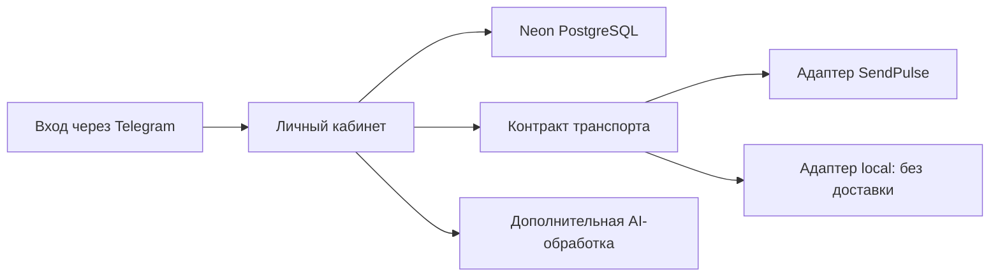

# Личный кабинет — практика между консультациями

[English](README.md) · [Русский](README.ru.md)

Открытый Личный кабинет для саммари консультаций, дневников, связок и обзоров периода. Его можно развернуть со **своими** базой, Telegram-ботом, аккаунтом AI и, при необходимости, SendPulse и SMTP.

В репозитории есть приложение, миграции базы, средства настройки и инструкции оператора. Здесь нет рабочего сервиса автора, его аккаунтов, базы подписчиков и экспорта частного бота. Интерфейс на русском; инструкции на русском и английском.

## Что входит в поставку

- Семь рабочих разделов: базовые настройки, все переменные, саммари консультаций, дневники, разборы, связки и ретро.
- Вход через Telegram Login Widget / WebApp, подписанные сессии и серверная проверка принадлежности контакта пользователю.
- Предпросмотр саммари и применение выбранных полей, фоновые AI-задачи, дополнительная отправка email.
- Контракт транспорта и два адаптера: **SendPulse** и **local**. Обработчики приложения обращаются к этому контракту вместо прямого импорта API провайдера.
- Миграции базы, создание конфигурации без перезаписи существующей, проверка окружения и сборка только разрешённых публичных ресурсов.
- [Инструкция установки](docs/operator-install.ru.md), [комплект настройки SendPulse](docs/sendpulse-setup.ru.md) и [полный пользовательский гид](docs/user-guide.ru.md).



## Установка со своими аккаунтами

Нужны Node.js 22.9+, совместимая с Neon база и Telegram-бот. Серверные функции работают на нынешнем стеке Netlify. SendPulse можно отключить режимом `local`; база приложения и Telegram-вход при этом остаются обязательными. **Это не офлайн-приложение.**

```sh
git clone https://github.com/KiteTools/selfdev-cabinet.git
cd selfdev-cabinet
npm ci
npm run setup
```

`setup` создаёт игнорируемый Git файл `.env` с новыми случайными секретами и отказывается перезаписывать существующий файл. Заполните настройки своих аккаунтов. Затем пройдите [инструкцию установки](docs/operator-install.ru.md): проверка конфигурации, миграции пустой базы, публикация только `dist/` вместе с каталогом Functions, настройка домена бота и первый вход. Корень репозитория нельзя публиковать как статический сайт.

```sh
npm run check:env
npm run migrate
npm run build
npm test
```

Без аргументов `migrate` показывает план и ничего не меняет. Для применения нужны явный `--apply` и установленный `psql`. Резервное копирование, восстановление и обновление описаны в инструкции.

## Как заменить SendPulse

`CABINET_TRANSPORT=sendpulse` включает интеграцию SendPulse; `local` сохраняет данные в базе без доставки в бот. Для другого провайдера нужно реализовать контракт из `netlify/functions/lib/transport.js`, включая проверяемую привязку аккаунта, затем добавить адаптер в фабрику и тесты. [Контракт адаптера](docs/transports.ru.md).

В этом выпуске выделена граница адаптера. Прямой Telegram-бот, надёжная очередь исходящих сообщений, автоматическое повторение входящих событий и миграция существующих привязок между провайдерами пока не реализованы. Схема базы сохраняет технические имена для совместимости, например `sendpulse_contact_id`. Сохранение поля в базе само по себе не означает, что оно доставлено в бот.

## Данные и проверки

В поставке только исходники и вымышленные примеры. Развёрнутое вами приложение хранит личные данные и может передавать выбранный материал настроенным сервисам. [Границы работы с данными](PRIVACY.ru.md).

Тесты используют вымышленные данные и имитации сервисов. Они проверяют вход и принадлежность контакта, транспорт, контракты интерфейса, средства установки и авторизацию фоновых задач. Живую установку на ваших аккаунтах, доставку в бот, результаты AI и отправку писем нужно отдельно проверить по инструкции оператора; успешные локальные тесты этого не подтверждают.

Часть [Skills for Selfdev](https://github.com/KiteTools/skills-for-selfdev/blob/main/README.ru.md). Лицензия MIT. AI помогает готовить материал и поддерживать выбранную практику; он не заменяет консультанта и не принимает решения за человека.
