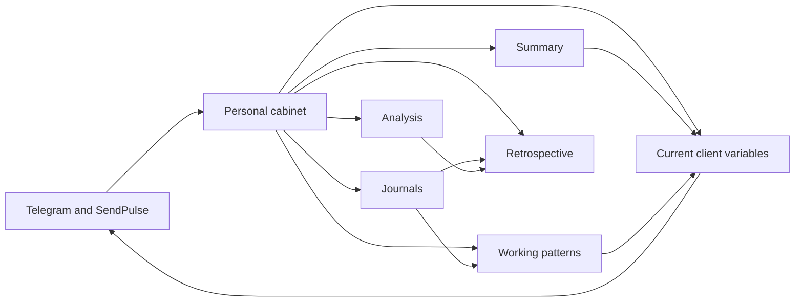
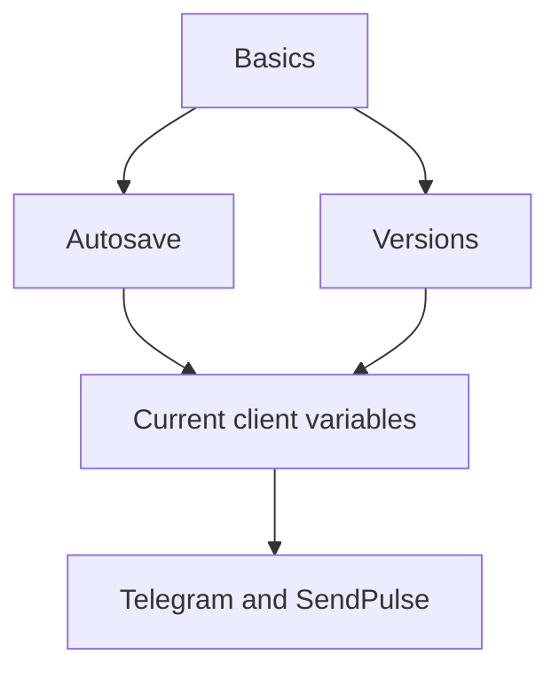
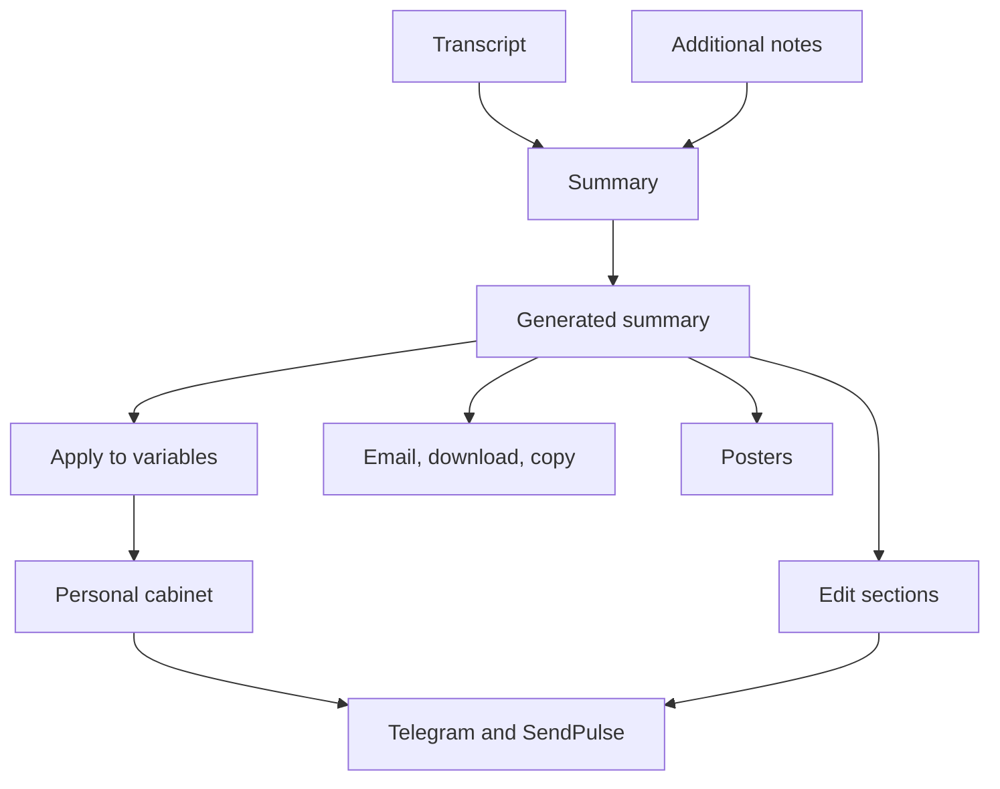
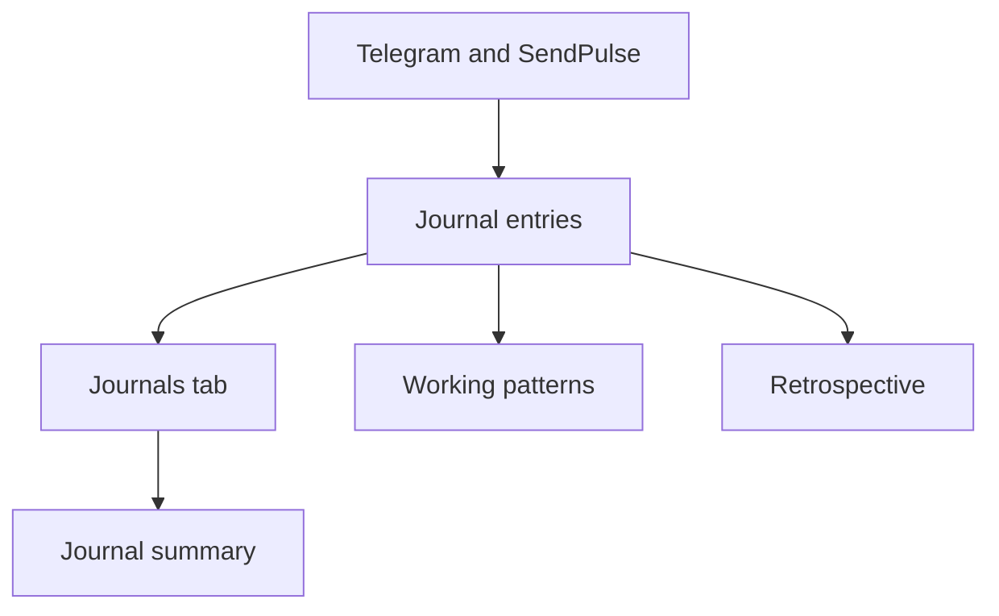
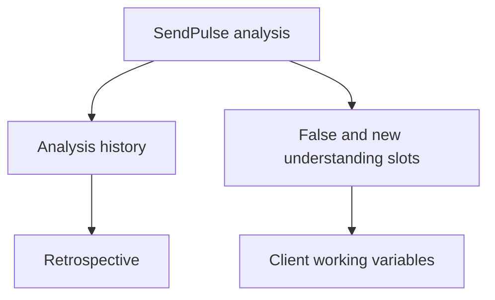
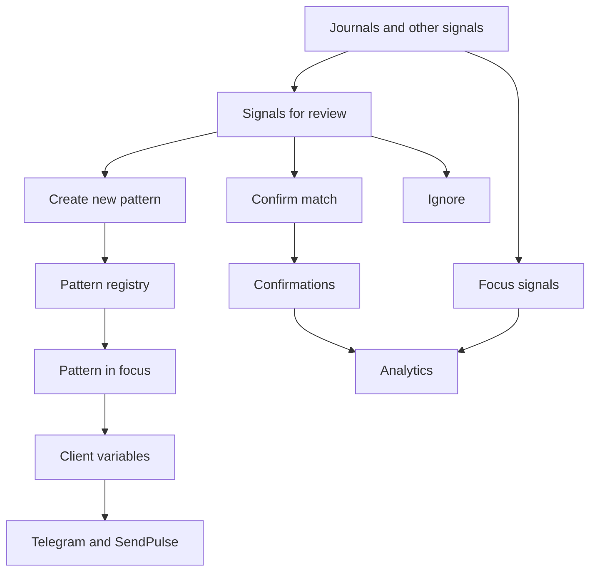
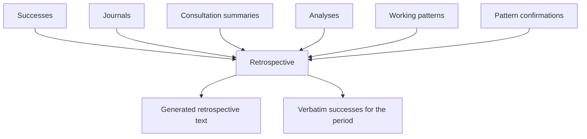
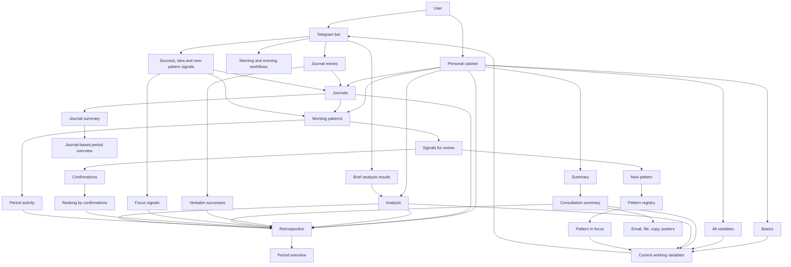

# Personal Cabinet user guide

[English](user-guide.md) · [Русский](user-guide.ru.md)

The complete user guide for the existing **SendPulse-enabled** workflow. In this distribution, `local` mode saves without bot delivery; current setup and differences are in the [operator guide](operator-install.md). Publishing source does not grant access to another person's service. Russian interface labels are retained; “working pattern” translates «связка».

[Home](../README.md) · [SendPulse setup](sendpulse-setup.md)

This document is a simple map of the personal cabinet: what it contains, what each tab is for, where information goes, and how the parts work together.

The personal cabinet does not replace the Telegram bot. It brings together:

- the client's current working variables;
- consultation results;
- journals for a selected period;
- analyses received from SendPulse;
- work with patterns;
- a retrospective for a selected period.

## 1. What happens here

The cabinet is organized around one cycle:

1. The client interacts with the Telegram bot and attends consultations.
2. Signals, answers, and texts enter the personal cabinet.
3. The cabinet turns them into variables, summaries, analyses, working patterns, and retrospectives.
4. Some cabinet data goes back to the bot and influences subsequent messages, questions, and workflows.

## 2. How to sign in

The sign-in process is:

1. The client first sends `/start` to the Telegram bot.
2. The bot then takes the client to the browser and opens the personal cabinet as a regular web page.
3. The cabinet offers sign-in through the Telegram Login Widget.

In practice:

- without `/start`, the cabinet cannot link a person to their data;
- the cabinet uses Telegram as its main means of confirming identity;
- a user who is already authenticated goes straight into the interface.

## 3. The main operating principle

The cabinet has two kinds of action.

The first kind is **autosaving**. These are ordinary fields and text blocks. The user edits them, and the cabinet saves the changes automatically. There is no separate Save button for these fields. A status strip at the top shows the state, such as `Сохраняю...` (Saving...) or `Сохранено` (Saved).

The second kind is **starting a task**. These are buttons such as:

- `Создать саммари` — Create summary;
- `Создать саммари за период` — Create period summary;
- `Обновить сигналы` — Refresh signals;
- `Сделать ретро` — Create retrospective.

These actions start a separate processing task: a request goes to ChatGPT through the API, the model receives and examines substantial context, and then returns a structured result to the cabinet. This is a full AI task rather than an instant action. Depending on the amount of context, generating a summary or retrospective can take up to five minutes.

Put simply:

- `Создать саммари` in the `Summary` tab creates a structured summary of one consultation from its transcript and notes.
- `Создать саммари за период` in `Дневники` (Journals) brings together the meaning of journal entries from a selected period between consultations.
- `Сделать ретро` in `Ретро` (Retrospective) creates a broad review of the period using several sources at once. It is usually useful before the next consultation, so the client arrives with a coherent view of the intervening period.

## 4. A quick map of the tabs

| Tab | Purpose | What the user sees |
| --- | --- | --- |
| `Базовые` — Basics | Quickly manage the main daily variables | Morning and evening questions, affirmations, quotes, the pattern in focus, versions, starter sets |
| `Все переменные` — All variables | Work with the client's full set of variables | System settings, timezone, name, the pattern in focus and an additional pattern, ChatGPT instructions, daily fields |
| `Summary` | Upload a consultation transcript and receive a structured summary | File upload, notes, email, result, section editor, consultation history |
| `Дневники` — Journals | View entries for a period and summarize them | Period filter, entry list, period summary |
| `Разбор` — Analysis | View and edit analysis blocks for SendPulse | Slots for false and new understandings, analysis history |
| `Связки` — Working patterns | Manage the pattern registry and its analytics | The pattern in focus, signals for review, working and archived patterns, period activity, ranking by confirmations |
| `Ретро` — Retrospective | Review a period using several sources at once | Period selection, retrospective text, verbatim successes, retrospective history |

## 5. The Basics tab — `Базовые`

This is the most practical tab. It gathers the things that usually need to be changed most quickly.

It contains:

- the time for the morning question;
- the time for the evening question;
- the morning question;
- the evening question;
- `Аффирмации` — Affirmations;
- `Цитаты` — Quotes;
- `Связка в фокусе` — Pattern in focus;
- `Версии` — Versions;
- `Стартовые наборы` — Starter sets.

### What this tab does

- Helps quickly adjust the client's daily rhythm.
- Keeps the current pattern in focus visible.
- Allows a quick return to earlier versions.
- Applies a starter set of affirmations, quotes, and questions in one action.

### What the Research and Debug sets mean

The `Стартовые наборы` (Starter sets) block has two modes.

`Research`

- Is intended for a period of observation and exploration.
- Helps notice recurring reactions, separate facts from interpretations, and map patterns.
- Is useful when the priority is to understand the existing automatic response more precisely before rushing to change behavior.

`Debug`

- Is intended for a period of putting a new response into practice.
- Shifts the focus from observation to applying a new understanding in real triggering situations.
- Is useful when the working pattern is already clear enough and the task is to change the response in everyday situations as well as notice it.

Both sets immediately overwrite:

- 10 affirmations;
- 10 quotes;
- the morning question;
- the evening question.

### What to keep in mind

- Changes here are saved automatically.
- Changes to the pattern in focus affect both the cabinet and what the bot sees afterward.
- There is no free-form pattern mode: the server keeps the pattern in focus as a card from the pattern registry.
- Version history provides a way back if a field was overwritten by mistake.

### Mini diagram

## 6. The All variables tab — `Все переменные`

This is the full view for managing the client's state.

Here you can change:

- system parameters: cycle day, timezone, and name;
- the morning and evening algorithms;
- `Связка в фокусе` (Pattern in focus) and `Дополнительная связка` (Additional pattern);
- the `Инструкции ChatGPT` (ChatGPT instructions) block;
- daily fields: affirmation of the day, quote of the day, message counter, and sprint task.

### Why it is useful

If Basics is a quick control panel, All variables is the full set of controls.

Use it when you need to:

- adjust the bot's detailed instructions;
- manually correct the client's context;
- change the pattern in focus directly;
- configure system parameters that affect how workflows behave.

### What happens when the pattern in focus changes

The cabinet treats `gpt_situation` and `link_main` as two representations of the same pattern in focus.

This means:

- changing `Связка в фокусе` in Basics also changes the field in All variables;
- changing `Связка в фокусе` in All variables also changes the block in Basics;
- the server finds or creates the matching card in the working-pattern registry and makes it the pattern in focus;
- that pattern is then synchronized to the bot's working variables;
- changing its text or switching to a different pattern resets the `Сигналы по фокусу` (Focus signals) counter.

## 7. The Summary tab

This tab processes consultations.

The user sees:

- a transcript upload;
- an optional notes upload;
- an email field for automatic delivery;
- `Создать саммари` — Create summary;
- the generated summary;
- `Применить` (Apply), `Скачать` (Download), `Копировать` (Copy), `Email`, and `Плакаты` (Posters) buttons;
- a section editor;
- consultation history.

### How it works

1. Upload a consultation transcript.
2. Optionally upload additional notes.
3. The cabinet sends all this context to ChatGPT through the API.
4. The model examines the consultation material, compares lines of analysis, and extracts new and false understandings, working patterns, questions, affirmations, quotes, and other useful elements.
5. A structured summary is returned.
6. The user decides what to do with it next.

### What additional notes do

When `Заметки` (Notes) are uploaded, they enrich the summary processing. The cabinet treats them as notes of what the consultant said and uses them to improve the summary sections.

### What the actions after generation mean

`Применить` — Apply

- Is the key action after a consultation.
- Does more than save the text.
- First previews the fields that will be overwritten.
- Lets the user choose which groups of fields will actually be updated.
- After confirmation, updates the client's variables and immediately passes the material discussed in the session to the bot.
- If the summary contains a working pattern, the first applied pattern becomes the pattern in focus and is synchronized with the working-pattern registry.
- This means that throughout the next period between consultations, the bot accompanies the client using the most current content developed during the live session with the consultant.
- Ongoing support is therefore based on the meanings, patterns, wording, and conclusions reviewed with the live consultant, rather than on arbitrary LLM guesses.

`Скачать` — Download

- Downloads the current summary as a Markdown file.

`Копировать` — Copy

- Copies the summary text to the clipboard.

`Email`

- Sends the summary to the selected address.

`Плакаты` — Posters

- Generates text prompts for posters based on the summary.

### What the Section editor is

`Редактор секций` (Section editor) is a working view over the generated summary.

It lets the user:

- remove unnecessary items;
- remove whole sections;
- send individual items or whole sections `в бот` (to the bot).

The `в бот` button is useful when you want a specific result rather than applying the entire summary:

- quotes;
- affirmations;
- questions;
- working patterns;
- talents;
- recurring pitfalls;
- motivations;
- context.

### Mini diagram

## 8. The Journals tab — `Дневники`

This tab does not create journals manually. It gathers entries that have already arrived in the system from the Telegram bot and through SendPulse.

The user sees:

- a period selector;
- start and end dates;
- `Обновить список` — Refresh list;
- `Создать саммари за период` — Create period summary;
- `Саммари дневников` — Journal summary;
- a list of recent entries.

### Which entries appear here

Journal entries are usually created in the Telegram bot in two ways:

- the client writes them as text;
- the client sends them as voice messages.

Voice messages are then transcribed through SendPulse and enter the personal cabinet as text. The Journals tab therefore shows the text of the entries rather than their audio.

The main types are:

- ordinary journal text;
- a success;
- a new working pattern;
- an idea or impulse.

### Why this tab is useful

It serves two purposes:

1. It lets the user inspect the original entries for a period.
2. It brings their meaning together into an overview of that period.

The `Создать саммари за период` (Create period summary) button is especially useful between consultations. It shows what actually filled the period, which themes recurred, where there was progress, and where the client got stuck or returned to the same pattern.

### What happens to journals afterward

Journals also feed other parts of the cabinet:

- they enter the journal summary;
- they contribute to the retrospective;
- they become signals for the Working patterns block;
- successes from journals also appear in a separate verbatim block in the retrospective.

### Mini diagram

## 9. The Analysis tab — `Разбор`

This tab relates to the analysis performed in the Telegram bot and then sent to the cabinet through SendPulse.

It contains:

- `Ложные понимания для SendPulse` — False understandings for SendPulse;
- `Новые понимания для SendPulse` — New understandings for SendPulse;
- `История разборов` — Analysis history.

### What the user does here

The user can:

- manually edit 10 slots for false understandings;
- manually edit 10 slots for new understandings;
- view completed analyses received from outside the cabinet.

### What matters

- These fields behave like ordinary variables and are saved automatically.
- Analysis history shows completed final records received from SendPulse.
- Analyses also contribute to the retrospective for the period.

### How to understand the analysis process

Analysis in the Telegram bot follows a detailed, multi-step instruction rather than a single step. Its purpose is to help examine a particular working pattern:

- what the stimulus was;
- which response was activated;
- which false understanding led to the unwanted result;
- which new understanding should replace that false understanding.

The bot does not build this analysis from an empty starting point. It draws on the false and new understandings the client has already received in a session with a live consultant. Analysis between consultations therefore helps apply meanings already found in the session to a concrete life situation, rather than merely talking about a problem.

### Mini diagram

## 10. The Working patterns tab — `Связки`

This is one of the key tabs. It gathers recurring patterns, keeps one pattern in focus, and shows separate analytics for signals and confirmations.

The user sees:

- `Обновить сигналы` — Refresh signals;
- `Связка в фокусе` — Pattern in focus;
- `Сигналы на разбор` — Signals for review;
- `Рабочие связки` — Working patterns;
- `Архив связок` — Pattern archive;
- `Аналитика` (Analytics), including `Активность за период` (Period activity) and `Топ по подтверждениям` (Ranking by confirmations).

### How new signals get here

Pattern signals come from several places:

- journals;
- successes;
- ideas;
- signals of a new working pattern;
- some external CRM / SendPulse events.

The AI then tries to determine whether:

- a signal matches an existing pattern;
- it represents a new pattern;
- it is noise that can be ignored.

### What you can do with a signal for review

Each suggestion has three main actions:

- `Подтвердить попадание` — Confirm match;
- `Создать новую связку` — Create a new pattern;
- `Не учитывать` — Ignore.

### What you can do with an existing pattern

A pattern card provides these actions:

- `Редактировать` — Edit;
- `Сделать фокусом` (Make focus) or `Обновить фокус` (Update focus);
- `Подтвердить прогресс` — Confirm progress;
- `В архив` (Archive) or `Вернуть в работу` (Return to active work).

### What the pattern in focus is

The pattern in focus is the client's current working pattern.

Keep in mind:

- it is always a card from the working-pattern registry;
- it is synchronized with Summary, Basics, and the situation variable;
- it is not duplicated separately in the Working patterns list;
- there is no free-form pattern mode here.

### How to read progress

The Pattern in focus card displays two separate metrics:

- `Сигналы по фокусу` — Focus signals;
- `Подтверждения` — Confirmations.

`Сигналы по фокусу` — Focus signals

- Is an automatic count of incoming successes, new patterns, and ideas while this particular pattern is in focus.

`Подтверждения` — Confirmations

- Are manually confirmed and AI-confirmed matches of signals to this particular card.

Below, the Analytics block shows period activity on three separate scales:

- `Успехи` — Successes;
- `Новые связки` — New patterns;
- `Идеи` — Ideas.

It also separately shows:

- `Топ по подтверждениям` — Ranking by confirmations.

### What resets the Focus signals counter

Changing or rewriting the pattern in focus resets the automatic Focus signals counter.

This happens when:

- the user edits the current pattern in focus;
- the user makes another working pattern the focus;
- the pattern text changes through a related mechanism, such as Summary or All variables.

Confirmations remain attached to individual pattern cards. They are not a second automatic increment of the same counter.

### Mini diagram

## 11. The Retrospective tab — `Ретро`

This is a periodic review that brings several data streams together. It is usually most useful before the next consultation, so the client arrives with a coherent view of the period.

The user sees:

- a period selector;
- `Сделать ретро` — Create retrospective;
- the generated retrospective text;
- `Сохранить` (Save), `Копировать` (Copy), and `Отправить на почту` (Send by email);
- a separate `Успехи за период` (Successes for the period) block;
- retrospective history.

### What goes into a retrospective

A retrospective draws on more than journals. It gathers input from:

- verbatim successes for the period;
- journals;
- consultation summaries;
- completed analyses;
- new working patterns;
- pattern confirmations;
- some external events.

### Why successes have a separate block

It shows successes word for word, without paraphrasing.

This helps:

- preserve the client's exact wording;
- quickly see the period's actual results;
- ground the retrospective in real records as well as interpretation.

### How this relates to ideas

Ideas or impulses recorded during the period enter the retrospective's overall input. The purpose is to help see not only the overall picture, but also:

- what was implemented;
- what was deferred;
- what remained without action.

### Mini diagram

## 12. What Telegram / SendPulse does alongside the cabinet

The cabinet and bot work together. Each has its own role.

### What the bot mainly does

- Maintains the client's daily rhythm.
- Asks morning and evening questions.
- Receives journal entries.
- Receives signals of successes, ideas, and new patterns.
- Completes and sends some external analyses.

### What the cabinet mainly does

- Stores and displays the client's state.
- Provides a convenient editing interface.
- Creates periodic summaries.
- Supports pattern management.
- Creates retrospectives.
- Lets the user manually confirm and direct AI results.

### How signals move between them

The cabinet usually sends the bot:

- questions;
- affirmations;
- quotes;
- the pattern in focus;
- some other working variables.

The bot usually sends the cabinet:

- journals;
- successes;
- ideas;
- signals of new working patterns;
- brief analysis results.

## 13. Typical workflows

### Scenario 1. After a consultation

1. Open the `Summary` tab.
2. Upload the transcript.
3. Upload notes if needed.
4. Enter an email address.
5. Click `Создать саммари` (Create summary).
6. Review the result.
7. Click `Применить` (Apply) so the meanings, patterns, quotes, questions, and other key elements discussed in the session enter the bot's working variables immediately, and a pattern from the summary can become the pattern in focus when appropriate.
8. If needed, send individual sections `в бот` (to the bot).

### Scenario 2. Review a period using journals

1. Open `Дневники` (Journals).
2. Select a period.
3. Click `Обновить список` (Refresh list).
4. Review the original entries.
5. Click `Создать саммари за период` (Create period summary) to bring together the meaning of how the client experienced this interval between consultations.
6. Copy the result or send it by email.

### Scenario 3. Work with patterns

1. Open `Связки` (Working patterns).
2. Click `Обновить сигналы` (Refresh signals).
3. Review `Сигналы на разбор` (Signals for review).
4. Choose an action for each signal: `Подтвердить попадание` (Confirm match), `Создать новую связку` (Create a new pattern), or `Не учитывать` (Ignore).
5. Edit a pattern card if needed.
6. Make the appropriate working pattern the focus if needed.

### Scenario 4. Create a retrospective before the next consultation

1. Open `Ретро` (Retrospective).
2. Select a period.
3. Click `Сделать ретро` (Create retrospective).
4. Wait for the broad review of the period to be assembled from all key sources.
5. Read the generated text.
6. Separately check the `Успехи за период` (Successes for the period) block.
7. Save, copy, or email the result.
8. Use it to prepare for the next live consultation.

### Scenario 5. Restore an earlier state

1. Open `Базовые` (Basics).
2. Go to `Версии` (Versions).
3. Select the required date.
4. Click `Восстановить` (Restore).
5. Check that the required fields have been restored.

## 14. If something is not working

### You cannot sign in

- First check that `/start` has already been sent to the Telegram bot.
- Open the cabinet again.
- If the browser opened the cabinet but sign-in did not finish, try the Telegram Login Widget again.
- If the cabinet shows its start screen, click `Проверить ещё раз` (Check again).

### Fields are not saving

- Look at the status strip at the top.
- If it shows an error, first check required fields, especially time and timezone.
- Try changing the field again and wait for `Сохранено` (Saved).

### Summary is not being generated

- Check the file format: `.txt`, `.md`, and `.vtt` are supported.
- Check the file size.
- Check that the email address is entered correctly.
- Remember that this AI processing can take up to five minutes, especially with a large context.
- If generation appears stuck, open `История консультаций` (Consultation history) and check whether the result appeared later.

### Journals is empty

- First check that the correct period is selected.
- Then click `Обновить список` (Refresh list).
- If there are no entries, none arrived from the bot or an external workflow during that period.

### Working patterns has no suggestions

- Click `Обновить сигналы` (Refresh signals).
- If Signals for review is still empty, either there were no new signals or the AI did not find useful suggestions in them.

### Retrospective shows an error

- Check the period.
- A retrospective cannot be assembled if the period has no data.
- If there is enough data, try again later.

## 15. Complete process diagram

The following diagram shows the cabinet as one system from the user's perspective.

## 16. Quick guide: when to use each tab

- Basics — when you need to quickly adjust the daily working setup.
- All variables — when you need deeper system configuration.
- Summary — after a consultation.
- Journals — when you need a view of a period grounded in actual entries.
- Analysis — when you need to view or edit an analysis received from SendPulse.
- Working patterns — when you need to review new signals, maintain the working-pattern registry, and see the current focus.
- Retrospective — when you need an overall view of a period using all important sources at once.

The cabinet turns the client's scattered signals into a clear working picture and returns that picture to the everyday work of the bot and consultant.
