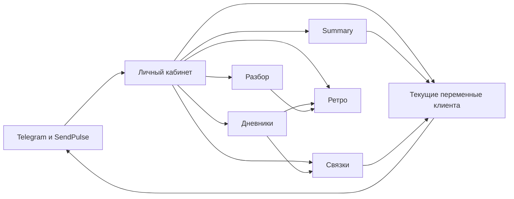
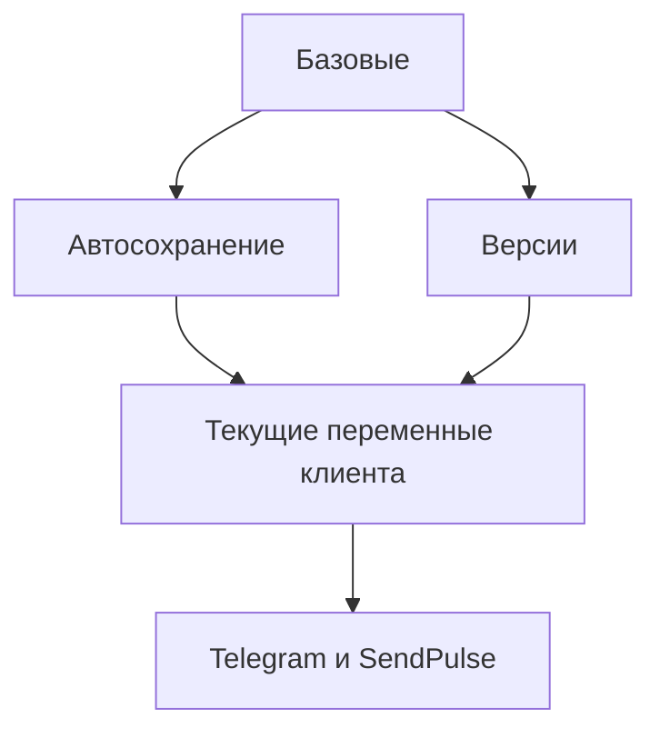
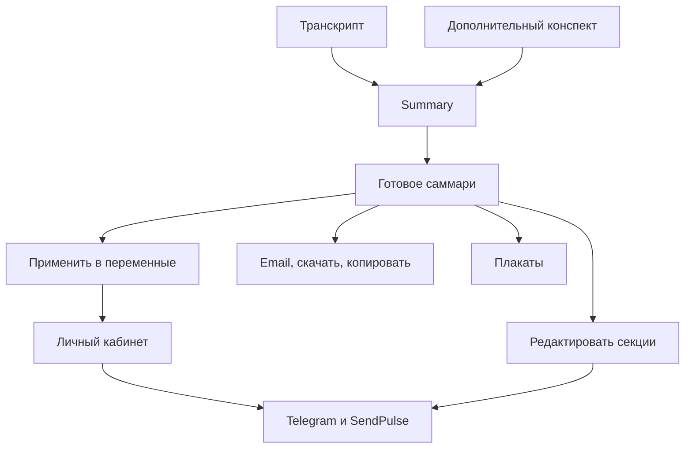
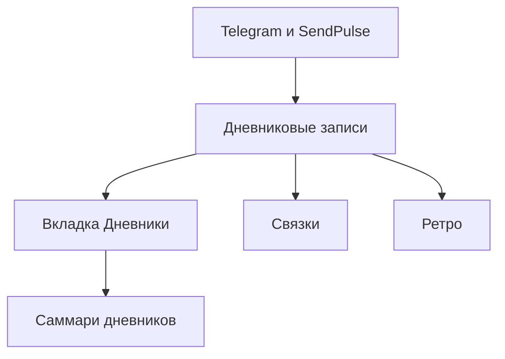
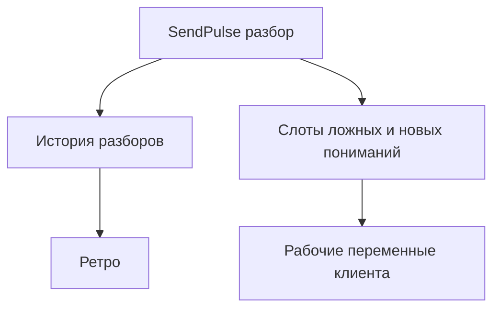
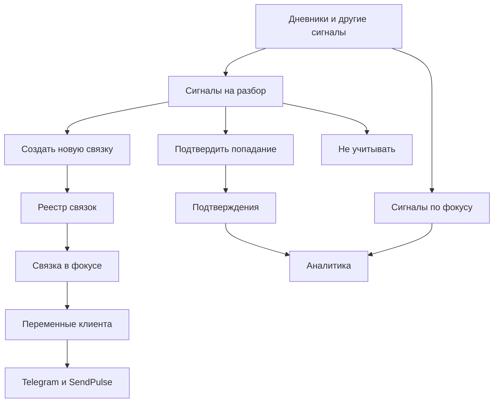
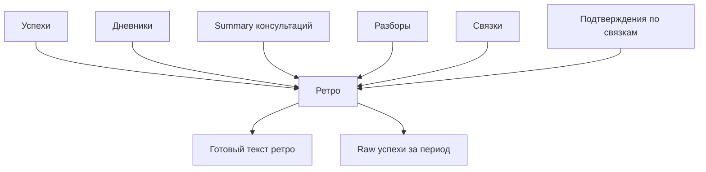
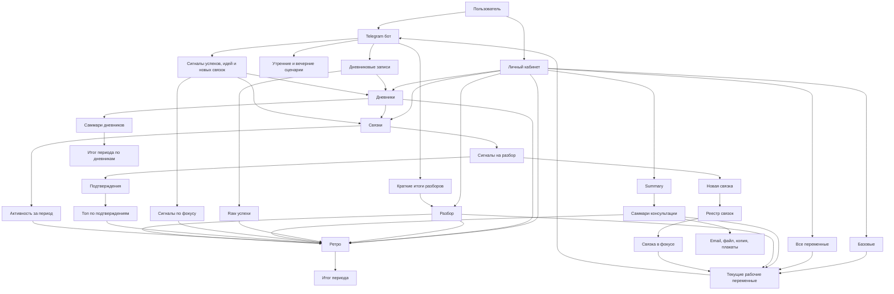

# Гид по Личному кабинету

[English](user-guide.md) · [Русский](user-guide.ru.md)

Полная пользовательская инструкция существующего сценария **с SendPulse**. В новой поставке режим `local` сохраняет данные без доставки в бот; настройки входа и актуальные различия описаны в [инструкции оператора](operator-install.ru.md). Публикация кода не предоставляет доступ к чужому сервису.

[На главную](../README.ru.md) · [Настройка SendPulse](sendpulse-setup.ru.md)

Этот документ нужен как простая карта личного кабинета: что в нём есть, зачем каждая вкладка нужна, что куда передаётся и как все части работают вместе.

Личный кабинет не заменяет Telegram-бота. Он собирает в одном месте:
- текущие рабочие переменные клиента;
- результаты консультаций;
- дневники за период;
- разборы, которые пришли из SendPulse;
- работу со связками;
- ретро по выбранному периоду.

## 1. Что здесь вообще происходит

Вся логика кабинета строится вокруг одного цикла:

1. Клиент взаимодействует с Telegram-ботом и проходит консультации.
2. Сигналы, ответы и тексты попадают в личный кабинет.
3. В кабинете это превращается в переменные, саммари, разборы, связки и ретро.
4. Часть данных из кабинета снова уходит в бот и влияет на следующие сообщения, вопросы и сценарии.

## 2. Как зайти в кабинет

Путь входа такой:

1. Клиент сначала делает `/start` в Telegram-боте.
2. После этого бот переводит клиента в браузер и открывает личный кабинет как обычную веб-страницу.
3. Кабинет предлагает вход через Telegram Login Widget.

Что это значит на практике:
- без `/start` кабинет не сможет привязать человека к его данным;
- кабинет использует Telegram как основной способ подтверждения личности;
- если пользователь уже авторизован, он сразу попадает в интерфейс.

## 3. Главный принцип работы

В кабинете есть два типа действий.

Первый тип: действия с автосохранением.
Это обычные поля и текстовые блоки. Пользователь меняет их, а кабинет сам сохраняет изменения. Отдельной кнопки "Сохранить" там нет. Состояние видно в верхней плашке: например, `Сохраняю...` или `Сохранено`.

Второй тип: запуск задач.
Это кнопки вроде:
- `Создать саммари`
- `Создать саммари за период`
- `Обновить сигналы`
- `Сделать ретро`

Такие действия запускают отдельную обработку: сигнал уходит в ChatGPT через API, модель получает большой контекст и глубоко его обдумывает, а затем возвращает структурированный результат обратно в кабинет. Поэтому это не мгновенное действие, а полноценная AI-задача, и в зависимости от объёма контекста создание summary или ретро может занимать до 5 минут.

Если совсем просто:
- `Создать саммари` во вкладке `Summary` — это сделать структурированное саммари одной консультации по её транскрипту и заметкам.
- `Создать саммари за период` во вкладке `Дневники` — это собрать общий смысл из дневниковых записей за выбранный период между консультациями.
- `Сделать ретро` во вкладке `Ретро` — это собрать большой обзор периода из нескольких источников сразу. Обычно его удобно делать перед следующей консультацией, чтобы прийти на сессию уже с цельной картиной прошедшего периода.

## 4. Быстрая карта вкладок

| Вкладка | Для чего нужна | Что видит пользователь |
| --- | --- | --- |
| `Базовые` | Быстро управлять главными ежедневными переменными | вопросы утром и вечером, аффирмации, цитаты, связка в фокусе, версии, стартовые наборы |
| `Все переменные` | Работать с полной картиной переменных клиента | системные настройки, таймзона, имя, связка в фокусе и дополнительная связка, инструкции ChatGPT, ежедневные поля |
| `Summary` | Загружать транскрипт консультации и получать структурированное саммари | загрузка файла, заметки, email, результат, редактор секций, история консультаций |
| `Дневники` | Смотреть записи за период и собирать по ним саммари | фильтр периода, список записей, саммари за период |
| `Разбор` | Смотреть и редактировать блоки разбора для SendPulse | слоты ложных и новых пониманий, история разборов |
| `Связки` | Управлять реестром связок и их аналитикой | связка в фокусе, сигналы на разбор, рабочие и архивные связки, активность за период, топ по подтверждениям |
| `Ретро` | Собирать обзор периода из нескольких источников сразу | выбор периода, готовый текст ретро, raw-успехи, история ретро |

## 5. Вкладка `Базовые`

Это самая прикладная вкладка. Здесь собраны вещи, которые обычно нужно менять быстрее всего.

Что здесь есть:
- время утреннего вопроса;
- время вечернего вопроса;
- вопрос утром;
- вопрос вечером;
- блок `Аффирмации`;
- блок `Цитаты`;
- блок `Связка в фокусе`;
- блок `Версии`;
- блок `Стартовые наборы`.

### Что делает эта вкладка

- помогает быстро поправить ежедневный ритм клиента;
- позволяет держать перед глазами текущую связку в фокусе;
- даёт быстро откатиться к прошлым версиям;
- позволяет одним действием применить стартовый набор аффирмаций, цитат и вопросов.

### Что такое наборы `Research` и `Debug`

В блоке `Стартовые наборы` есть два режима.

`Research`
- нужен для периода наблюдения и исследования;
- помогает замечать повторяющиеся реакции, отделять факт от интерпретации и собирать карту шаблонов;
- полезен, когда важно не торопиться менять поведение, а сначала точнее увидеть, как именно устроен старый автоматизм.

`Debug`
- нужен для периода внедрения нового реагирования;
- смещает фокус с наблюдения на применение нового понимания в реальных триггерах;
- полезен, когда связка уже достаточно ясна и задача теперь не только замечать, но и менять реакцию в живых ситуациях.

Оба набора сразу перезаписывают:
- 10 аффирмаций;
- 10 цитат;
- вопрос на утро;
- вопрос на вечер.

### Что важно понимать

- изменения здесь автосохраняются;
- изменения в связке в фокусе влияют не только на Личный кабинет, но и на то, что дальше видит бот;
- режима свободной связки нет: сервер держит связку в фокусе как карточку из реестра связок;
- история версий нужна как страховка, если поле случайно переписали.

### Мини-схема

## 6. Вкладка `Все переменные`

Это полный режим управления состоянием клиента.

Здесь можно менять:
- системные параметры: день цикла, таймзону, имя;
- алгоритм утра и вечера;
- `Связку в фокусе` и `Дополнительную связку`;
- блок `Инструкции ChatGPT`;
- ежедневные поля: аффирмация дня, цитата дня, счётчик сообщений, задача спринта.

### Зачем нужна

Если `Базовые` это быстрый пульт, то `Все переменные` это полная панель управления.

Её используют, когда нужно:
- скорректировать глубокие инструкции для бота;
- вручную поправить контекст клиента;
- изменить связку в фокусе напрямую;
- настроить системные параметры, от которых зависит поведение сценариев.

### Что происходит при изменении связки в фокусе

В кабинете `gpt_situation` и `link_main` считаются двумя представлениями одной и той же связки в фокусе.

Это значит:
- если пользователь меняет `Связка в фокусе` в `Базовых`, меняется и поле во `Все переменные`;
- если пользователь меняет `Связка в фокусе` во `Все переменные`, меняется и блок в `Базовых`;
- сервер находит или создаёт соответствующую карточку в реестре рабочих связок и делает её связкой в фокусе;
- эта связка потом синхронизируется в рабочие переменные бота;
- изменение текста или смена связки в фокусе обнуляет счётчик `Сигналы по фокусу`.

## 7. Вкладка `Summary`

Это вкладка для обработки консультаций.

Пользователь видит:
- загрузку транскрипта;
- необязательную загрузку заметок;
- поле email для авто-отправки;
- кнопку `Создать саммари`;
- готовое саммари;
- кнопки `Применить`, `Скачать`, `Копировать`, `Email`, `Плакаты`;
- редактор секций;
- историю консультаций.

### Как это работает

1. Загружается транскрипт консультации.
2. При желании загружается дополнительный конспект.
3. Кабинет отправляет весь этот контекст в ChatGPT через API.
4. Модель глубоко обрабатывает материал консультации, сопоставляет линии разбора, извлекает новые и ложные понимания, связки, вопросы, аффирмации, цитаты и другие рабочие элементы.
5. Возвращается структурированное саммари.
6. Пользователь решает, что с ним делать дальше.

### Что делает дополнительный конспект

Если загружены `Заметки`, они усиливают обработку саммари. Кабинет считает, что это конспект слов консультанта и должен использовать его для улучшения разделов саммари.

### Что означают действия после генерации

`Применить`
- это ключевое действие после консультации;
- не просто сохраняет текст;
- сначала показывает предпросмотр перезаписи полей;
- позволяет выбрать группы полей, которые реально будут обновлены;
- после подтверждения обновляет переменные клиента и сразу передаёт в бота обсуждённые на сессии вещи;
- если в саммари есть связка, первая применённая связка становится связкой в фокусе и синхронизируется с реестром рабочих связок;
- это означает, что весь следующий период между консультациями бот будет сопровождать клиента уже самым актуальным контентом, который родился на живой сессии с консультантом;
- именно на этом строится дальнейшее сопровождение: не на случайных догадках LLM, а на реальных смыслах, связках, формулировках и выводах, которые были разобраны вместе с живым консультантом.

`Скачать`
- скачивает текущее саммари как markdown-файл.

`Копировать`
- копирует текст саммари в буфер.

`Email`
- отправляет саммари на выбранный адрес.

`Плакаты`
- генерирует текстовые промпты для постеров по саммари.

### Что такое `Редактор секций`

Это рабочий режим поверх готового саммари.

Он позволяет:
- убирать лишние пункты;
- убирать целые разделы;
- отправлять отдельные пункты или целые разделы `в бот`.

Кнопка `в бот` нужна, когда не хочется применять всё саммари целиком, а нужно забрать только конкретный результат:
- цитаты;
- аффирмации;
- вопросы;
- связки;
- таланты;
- грабли;
- мотивации;
- контекст.

### Мини-схема

## 8. Вкладка `Дневники`

Эта вкладка не создаёт дневники вручную. Она собирает записи, которые уже пришли в систему из Telegram-бота и через SendPulse.

Пользователь видит:
- выбор периода;
- даты начала и окончания;
- кнопку `Обновить список`;
- кнопку `Создать саммари за период`;
- блок `Саммари дневников`;
- список последних записей.

### Какие записи сюда попадают

Дневники обычно создаются в Telegram-боте двумя способами:
- клиент пишет их текстом;
- клиент отправляет их голосом.

Дальше голосовые сообщения транскрибируются через SendPulse и попадают в личный кабинет уже в текстовом виде. Поэтому в самой вкладке `Дневники` пользователь видит уже не аудио, а готовый текст записей.

Основные типы:
- обычный дневниковый текст;
- успех;
- новая связка;
- идея или импульс.

### Зачем нужна эта вкладка

Она решает сразу две задачи:

1. Даёт посмотреть сырые записи за период.
2. Даёт собрать из них общий смысловой срез периода.

Кнопка `Создать саммари за период` особенно полезна между консультациями: она показывает, чем реально был наполнен период, какие темы повторялись, где был прогресс, а где клиент застревал или возвращался в один и тот же шаблон.

### Что дальше происходит с дневниками

Дневники не живут сами по себе. Они влияют и на другие части кабинета:
- попадают в саммари дневников;
- участвуют в ретро;
- становятся сигналами для блока `Связки`;
- успехи из дневников дополнительно показываются в ретро отдельным raw-блоком.

### Мини-схема

## 9. Вкладка `Разбор`

Эта вкладка связана с разбором, который выполняется в Telegram-боте и затем приходит в кабинет через SendPulse.

Что в ней есть:
- `Ложные понимания для SendPulse`;
- `Новые понимания для SendPulse`;
- `История разборов`.

### Что здесь делает пользователь

Пользователь может:
- вручную поправлять 10 слотов ложных пониманий;
- вручную поправлять 10 слотов новых пониманий;
- просматривать завершённые разборы, которые пришли извне.

### Что важно

- эти поля ведут себя как обычные переменные и автосохраняются;
- история разборов показывает уже завершённые итоговые записи из SendPulse;
- разборы также участвуют в ретро по периоду.

### Как понимать разбор

Разбор в Telegram-боте происходит не в один шаг, а по сложной многошаговой инструкции. Его задача — помочь разобрать конкретную связку:
- какой был стимул;
- какая включилась реакция;
- какое ложное понимание привело к нежелательному результату;
- каким новым пониманием это ложное понимание нужно заменить.

При этом бот не строит разбор с нуля в пустоте. Он опирается на ложные и новые понимания, которые клиент уже получил на сессии с живым консультантом. То есть разбор в периоде между консультациями помогает не просто "поговорить о проблеме", а применить уже найденные на сессии смыслы к конкретной жизненной ситуации.

### Мини-схема

## 10. Вкладка `Связки`

Это одна из самых важных вкладок, потому что здесь кабинет собирает повторяющиеся паттерны, держит одну связку в фокусе и отдельно показывает аналитику по сигналам и подтверждениям.

Что пользователь видит:
- кнопку `Обновить сигналы`;
- блок `Связка в фокусе`;
- блок `Сигналы на разбор`;
- список `Рабочие связки`;
- список `Архив связок`;
- блок `Аналитика` с `Активностью за период` и `Топом по подтверждениям`.

### Как сюда попадают новые сигналы

Сигналы для связок приходят из нескольких мест:
- дневники;
- успехи;
- идеи;
- сигналы новой связки;
- часть внешних CRM / SendPulse событий.

После этого AI пытается понять:
- это попадание в уже существующую связку;
- это новая связка;
- или это шум, который можно игнорировать.

### Что можно сделать с сигналом на разбор

У каждого предложения есть 3 основных действия:
- `Подтвердить попадание`;
- `Создать новую связку`;
- `Не учитывать`.

### Что можно делать с готовой связкой

На карточке связки доступны действия:
- `Редактировать`;
- `Сделать фокусом` или `Обновить фокус`;
- `Подтвердить прогресс`;
- `В архив` или `Вернуть в работу`.

### Что такое связка в фокусе

Связка в фокусе — это текущая рабочая связка клиента.

Важно:
- это всегда карточка из реестра рабочих связок;
- она синхронизируется с `Summary`, `Базовыми` и переменной ситуации;
- в списке `Рабочие связки` она отдельно не дублируется;
- режима свободной связки здесь нет.

### Как читать прогресс

На карточке `Связка в фокусе` кабинет показывает 2 отдельные метрики:
- `Сигналы по фокусу`;
- `Подтверждения`.

`Сигналы по фокусу`
- это автоматический счётчик входящих успехов, новых связок и идей, пока именно эта связка находится в фокусе.

`Подтверждения`
- это ручные и AI-подтверждённые попадания сигналов именно в эту карточку.

Ниже в блоке `Аналитика` кабинет показывает активность за период по 3 отдельным шкалам:
- `Успехи`;
- `Новые связки`;
- `Идеи`.

Там же отдельно показывается:
- `Топ по подтверждениям`.

### Что обнуляет счётчик `Сигналы по фокусу`

Если связка в фокусе меняется или переписывается, автоматический счётчик `Сигналы по фокусу` сбрасывается.

Это происходит, когда:
- пользователь редактирует текущую связку в фокусе;
- пользователь делает другой рабочий паттерн связкой в фокусе;
- меняется текст связки через связанные механизмы кабинета, например через `Summary` или `Все переменные`.

При этом `Подтверждения` остаются привязанными к конкретным карточкам связок и не являются вторым автоматическим инкрементом счётчика.

### Мини-схема

## 11. Вкладка `Ретро`

Это периодический обзор, который собирает вместе несколько потоков данных. Чаще всего его имеет смысл делать перед следующей консультацией, чтобы прийти на сессию уже с цельной картиной периода.

Что пользователь видит:
- выбор периода;
- кнопку `Сделать ретро`;
- готовый текст ретро;
- действия `Сохранить`, `Копировать`, `Отправить на почту`;
- отдельный блок `Успехи за период`;
- историю ретро.

### Из чего собирается ретро

Ретро не строится только по дневникам. Оно собирает вход из нескольких источников:
- raw-успехи за период;
- дневники;
- саммари консультаций;
- завершённые разборы;
- новые связки;
- подтверждения по связкам;
- часть внешних событий.

### Зачем нужен отдельный блок с успехами

Он показывает успехи дословно, без пересказа.

Это помогает:
- не потерять конкретные формулировки клиента;
- быстро увидеть фактические результаты периода;
- использовать ретро не только как интерпретацию, но и как опору на реальные записи.

### Как это связано с идеями

Если в периоде были идеи или импульсы, они попадают в общий вход для ретро. Смысл этого блока — не только подвести итог, но и помочь увидеть:
- что было реализовано;
- что было отложено;
- что так и осталось без действия.

### Мини-схема

## 12. Что именно делает Telegram / SendPulse рядом с Личным кабинетом

Личный кабинет не живёт отдельно от бота. У каждого своя роль.

### Что в основном делает бот

- ведёт ежедневный ритм клиента;
- задаёт утренние и вечерние вопросы;
- получает дневниковые записи;
- принимает сигналы успехов, идей и новых связок;
- завершает и присылает некоторые внешние разборы.

### Что в основном делает кабинет

- хранит и показывает состояние клиента;
- даёт удобный интерфейс редактирования;
- собирает периодические саммари;
- даёт управлять связками;
- делает ретро;
- позволяет вручную подтверждать и направлять AI-результаты.

### Как между ними ходят сигналы

Из кабинета в бот обычно уходят:
- вопросы;
- аффирмации;
- цитаты;
- связка в фокусе;
- часть других рабочих переменных.

Из бота в кабинет обычно приходят:
- дневники;
- успехи;
- идеи;
- сигналы новых связок;
- краткие итоги разборов.

## 13. Типовые сценарии использования

### Сценарий 1. После консультации

1. Зайти во вкладку `Summary`.
2. Загрузить транскрипт.
3. При необходимости загрузить заметки.
4. Ввести email.
5. Нажать `Создать саммари`.
6. Проверить результат.
7. Нажать `Применить`, чтобы обсуждённые на сессии смыслы, связки, цитаты, вопросы и другие ключевые элементы сразу ушли в рабочие переменные бота, а связка из саммари при необходимости стала связкой в фокусе.
8. При необходимости точечно отправить отдельные секции `в бот`.

### Сценарий 2. Разобрать период по дневникам

1. Открыть `Дневники`.
2. Выбрать период.
3. Нажать `Обновить список`.
4. Просмотреть сырые записи.
5. Нажать `Создать саммари за период`, чтобы собрать единый смысловой обзор того, как клиент прожил этот отрезок между консультациями.
6. Скопировать или отправить результат на почту.

### Сценарий 3. Поработать со связками

1. Открыть `Связки`.
2. Нажать `Обновить сигналы`.
3. Просмотреть `Сигналы на разбор`.
4. Для каждого сигнала выбрать одно действие: `Подтвердить попадание`, `Создать новую связку` или `Не учитывать`.
5. При необходимости отредактировать карточку связки.
6. При необходимости сделать нужную рабочую связку связкой в фокусе.

### Сценарий 4. Сделать ретро перед следующей консультацией

1. Открыть `Ретро`.
2. Выбрать период.
3. Нажать `Сделать ретро`.
4. Дождаться, пока соберётся большой обзор периода по всем ключевым источникам.
5. Посмотреть готовый текст.
6. Отдельно свериться с блоком `Успехи за период`.
7. Сохранить, скопировать или отправить на почту.
8. Использовать результат как подготовку к следующей живой консультации.

### Сценарий 5. Вернуть прошлое состояние

1. Открыть `Базовые`.
2. Перейти в блок `Версии`.
3. Выбрать нужную дату.
4. Нажать `Восстановить`.
5. Проверить, что нужные поля вернулись.

## 14. Если что-то не работает

### Не удаётся войти

- сначала проверь, что в Telegram-боте уже был выполнен `/start`;
- затем открой кабинет снова;
- если браузер открыл кабинет, но вход не завершился, попробуй ещё раз пройти вход через Telegram Login Widget;
- если кабинет показывает стартовый экран, нажми `Проверить ещё раз`.

### Не сохраняются поля

- посмотри на верхнюю статус-плашку;
- если там ошибка, сначала проверь обязательные поля, особенно время и таймзону;
- попробуй изменить поле ещё раз и дождаться статуса `Сохранено`.

### Не строится `Summary`

- проверь формат файла: поддерживаются `.txt`, `.md`, `.vtt`;
- проверь размер файла;
- проверь, что email введён корректно;
- помни, что такая AI-обработка может занимать до 5 минут, особенно если контекст большой;
- если генерация зависла, открой `История консультаций` и проверь, появился ли результат позже.

### В `Дневниках` пусто

- сначала убедись, что выбран правильный период;
- затем нажми `Обновить список`;
- если записей нет, значит в этот период они не приходили из бота или внешнего сценария.

### В `Связках` нет предложений

- нажми `Обновить сигналы`;
- если после этого в блоке `Сигналы на разбор` пусто, значит новых сигналов либо не было, либо AI не нашёл по ним полезных предложений.

### В `Ретро` ошибка

- проверь период;
- если за период нет данных, ретро не соберётся;
- если данных достаточно, попробуй повторить запуск позже.

## 15. Полная диаграмма процесса

Ниже одна большая схема, которая показывает кабинет как единую систему в пользовательской логике.

## 16. Коротко: как лучше пользоваться кабинетом

- `Базовые` — когда нужно быстро поправить ежедневную рабочую часть.
- `Все переменные` — когда нужно глубже настроить систему.
- `Summary` — после консультации.
- `Дневники` — когда нужен срез периода по живым записям.
- `Разбор` — когда нужно посмотреть или поправить разбор из SendPulse.
- `Связки` — когда нужно разобрать новые сигналы, вести рабочий реестр связок и видеть текущий фокус.
- `Ретро` — когда нужен общий обзор периода по всем важным источникам сразу.

Если смотреть совсем просто, личный кабинет делает одно: превращает разрозненные сигналы клиента в понятную рабочую картину и возвращает эту картину обратно в ежедневную работу бота и консультанта.
